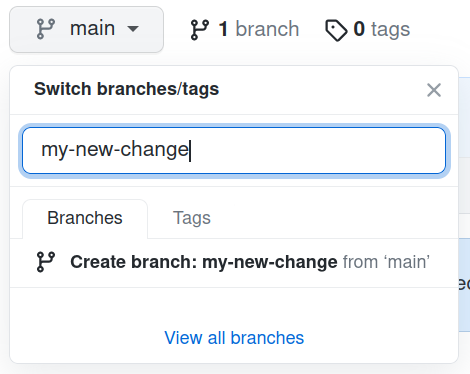
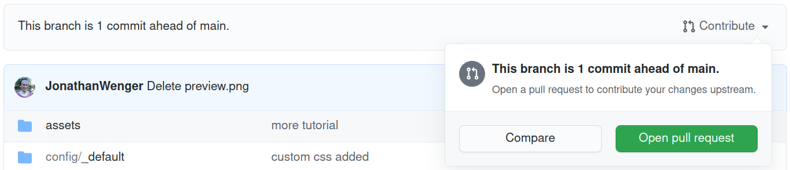

# Website of the Probabilistic Numerics Community

This repository contains the source files for [probabilistic-numerics.org](probabilistic-numerics.org), the website of the **Probabilistic Numerics** research field.

## Requesting Changes

You can request features or report bugs by creating an [issue](https://github.com/probabilistic-numerics/website/issues). Be aware that your requested change has much higher probability of being considered if you suggest it directly via a pull request (see contribution guide below).

## Contributing

The site is built using [Jekyll](https://jekyllrb.com/) with the [al-folio theme](https://github.com/alshedivat/al-folio). Bibliography support is provided by [Jekyll-Scholar](https://github.com/inukshuk/jekyll-scholar).

### Getting Started

You can make simple changes (text changes, new meetings, literature additions) directly in the browser!

#### Forking the Repository

In the top-right corner of the page, click **Fork**. More detail [here](https://docs.github.com/en/get-started/quickstart/fork-a-repo#forking-a-repository).

<div align="center">
    
</div>

#### Creating a new Branch

Create a new branch from the `main` branch named after your desired change.

<div align="center">
    
</div>

#### Making Changes

Now in the new branch navigate to the file you would like to edit and click the edit button.

<div align="center">
    
</div>

Make any changes you desire and commit the changes to the branch. More detail [here](https://docs.github.com/en/github/managing-files-in-a-repository/managing-files-on-github/editing-files-in-your-repository).

#### Creating a Pull Request

Finally, create a pull request to the main repository `probabilistic-numerics/website` by clicking on "Contribute > Open a Pull Request" and writing a verbose description of your change.

<div align="center">
    
</div>

Your suggested change is now subject to feedback and moderation by the maintainers before it will be merged. Congratulations!

### Advanced

#### Forking and Cloning the Repository
Fork the repository and GitHub and clone it to your local machine using `git`. It is recommended to set up `probabilistic-numerics/website` as a second `upstream` remote so you can easily keep up-to-date with the main repository. More detail [here](https://git-scm.com/book/en/v2/Git-Basics-Working-with-Remotes).

#### Installing Dependencies

If you have a Mac or Linux machine try the following command to install Ruby and Bundler:

```bash
sudo apt-get install ruby-dev
sudo gem install bundler
```

Then install the required dependencies and plugins for the site via:

```bash
bundle install
```

#### Making and Viewing Changes

You can edit the website and view the changes in real time via:

```bash
bundle exec jekyll serve --livereload --open-url
```


#### Creating a Pull Request
Once you are satisfied with your changes, `git push` them to your fork on GitHub and create a pull request to the main repository. Congratulations!
