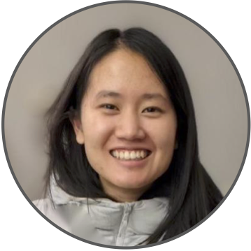
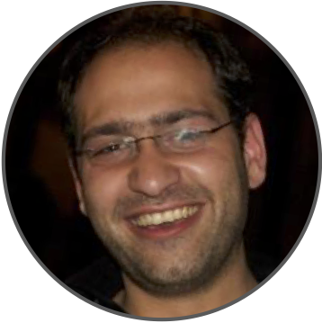

We are holding an online reading group focusing on <strong>modern adaptive experimental design and active learning in the real world</strong>.
All interested participants are welcome to join!

The reading group will be held on <strong>Thursdays</strong> at <strong>10am PST/California</strong>, <strong>6pm GMT/UK</strong>, <strong>7pm CET/Zurich</strong> time. To receive information via email, <a href="https://forms.gle/Ex1ut4YfL8E3qt7W6">subscribe to our mailing list</a>.

To join, please use the following <strong>Zoom link:</strong> <a href="https://ethz.zoom.us/j/67585775251">https://ethz.zoom.us/j/67585775251</a>

### Speaker Schedule

1. &nbsp;**January 12, 2023** &emsp;&nbsp;&nbsp;&nbsp; [Kelly W. Zhang](https://kellywzhang.github.io/)
    &emsp;&emsp;&emsp;&emsp;
2. &nbsp;**January 19, 2023** &emsp;&nbsp;&nbsp;&nbsp; [Kevin Jamieson](https://homes.cs.washington.edu/~jamieson/)
    &emsp;&emsp;&emsp;&nbsp;&nbsp;
3. &nbsp;**January 26, 2023** &emsp;&nbsp;&nbsp;&nbsp; [Raul Astudillo](https://raulastudillo.netlify.app/)
    &emsp;&emsp;&emsp;&emsp;&nbsp;&nbsp;
4. &nbsp;**February 2, 2023** &emsp;&nbsp;&nbsp;&nbsp;&nbsp; [Emmanuel Bengio](https://folinoid.com/)
    &emsp;&emsp;&nbsp;&nbsp;
5. &nbsp;**February 9, 2023** &emsp;&nbsp;&nbsp;&nbsp;&nbsp; [Zi Wang](https://ziw.mit.edu/)
    &emsp;&emsp;&emsp;&emsp;&emsp;&emsp;&ensp;&nbsp;
6. &nbsp;**February 16, 2023** &emsp;&nbsp; [Johannes Kirschner](https://johannes-kirschner.de/)
    &emsp;&ensp;&nbsp;
7. &nbsp;**February 23, 2023** &emsp;&nbsp; [Haitham Bou Ammar](http://bouammar.com/)
    &emsp;&nbsp;
8. &nbsp;**March 2, 2023** &emsp;&emsp;&nbsp;&nbsp;&nbsp;&nbsp; [Kevin Tran](https://ktran9891.github.io/)
    &emsp;&emsp;&emsp;&emsp;&emsp;&ensp;&nbsp;&nbsp;

### Talk Details

 &emsp;
[Kelly W. Zhang](https://kellywzhang.github.io/), &nbsp; **January 12, 2023**

**Title:** Inference after Adaptive Sampling for Longitudinal Data

**Abstract:** Online algorithms that learn to optimize treatments over time are increasingly used in a variety of digital intervention problems. These algorithms repeatedly update parameter estimates as data accrues; these parameter estimates are used to inform treatment decisions. These algorithms are called “adaptive sampling” algorithms and the resulting data is considered “adaptively collected.” In this work, we focus on data collected by a large class of adaptive sampling algorithms that are designed to optimize treatment decisions online using accruing data from multiple users. Combining or “pooling” data across users allows adaptive sampling algorithms to potentially learn faster. However, by pooling, these algorithms induce dependence between the collected user data trajectories; this makes statistical inference on this data-type especially challenging. We provide methods to perform a variety of statistical analyses on such adaptively collected data, including Z-estimation, off-policy analyses, and inferring excursion effects. This work is motivated by our work in designing experiments in which online reinforcement learning algorithms pool data across users to learn to optimize treatment decisions, yet reliable statistical inference is essential for conducting a variety of statistical analyses after the experiment is over.

**Bio:** Kelly W. Zhang is a final-year Ph.D. candidate in computer science at Harvard University advised by Susan Murphy and Lucas Janson. Her research focuses on addressing challenges faced when applying reinforcement learning algorithms to real-world problems. She has developed methods for statistical inference for data collected by bandit and reinforcement learning algorithms, i.e., adaptively collected data. She also works on developing the reinforcement learning algorithm to be used in Oralytics, a mobile health app aimed to help users develop healthy oral hygiene habits, in collaboration with Oral-B and researchers at UCLA and UMichigan. She is supported by an NSF Graduate Research Fellowship.

<!--1. &nbsp;**January 12, 2023** &emsp;&nbsp;&nbsp;&nbsp; [Kelly W. Zhang](https://kellywzhang.github.io/), Harvard University-->
<!--    &emsp;&emsp;&emsp;&emsp;-->
<!--2. &nbsp;**January 19, 2023** &emsp;&nbsp;&nbsp;&nbsp; [Kevin Jamieson](https://homes.cs.washington.edu/~jamieson/), University of Washington-->
<!--    &emsp;&emsp;&emsp;&nbsp;&nbsp;-->
<!--3. &nbsp;**January 26, 2023** &emsp;&nbsp;&nbsp;&nbsp; [Raul Astudillo](https://raulastudillo.netlify.app/), Caltech-->
<!--    &emsp;&emsp;&emsp;&emsp;&nbsp;&nbsp;-->
<!--4. &nbsp;**February 2, 2023** &emsp;&nbsp;&nbsp;&nbsp;&nbsp; [Emmanuel Bengio](https://folinoid.com/), Recursion-->
<!--    &emsp;&emsp;&nbsp;&nbsp;-->
<!--5. &nbsp;**February 9, 2023** &emsp;&nbsp;&nbsp;&nbsp;&nbsp; [Zi Wang](https://ziw.mit.edu/), Google Brain-->
<!--    &emsp;&emsp;&emsp;&emsp;&emsp;&emsp;&ensp;&nbsp;-->
<!--6. &nbsp;**February 16, 2023** &emsp;&nbsp; [Johannes Kirschner](https://johannes-kirschner.de/), University of Alberta-->
<!--    &emsp;&ensp;&nbsp;-->
<!--7. &nbsp;**February 23, 2023** &emsp;&nbsp; [Haitham Bou Ammar](http://bouammar.com/), UCL and Huawei London-->
<!--    &emsp;&nbsp;-->
<!--8. &nbsp;**March 2, 2023** &emsp;&emsp;&nbsp;&nbsp;&nbsp;&nbsp; [Kevin Tran](https://ktran9891.github.io/), Toyota Research Institute-->
<!--    &emsp;&emsp;&emsp;&emsp;&emsp;&ensp;&nbsp;&nbsp;-->

<!-- -->
<!-- &nbsp;-->
<!-- &nbsp;-->
<!-- &nbsp;-->
<!-- &nbsp;-->
<!-- &nbsp;-->
<!-- &nbsp;-->
<!-- &nbsp;-->
<!-- &nbsp;-->
