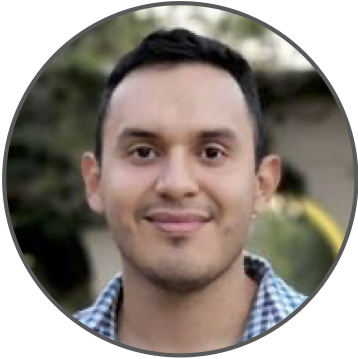

We are holding an online reading group focusing on <strong>modern adaptive experimental design and active learning in the real world</strong>.
All interested participants are welcome to join! (Zoom details forthcoming).  

The reading group will be held on <strong>Thursdays</strong> at <strong>10am PDT/California</strong>, <strong>6pm GMT/UK</strong>, <strong>7pm CEST/Zurich</strong> time.

### Speaker Schedule

1. &nbsp;**January 12, 2023** &emsp;&nbsp;&nbsp;&nbsp; [Kelly W. Zhang](https://kellywzhang.github.io/)
    &emsp;&emsp;&emsp;&emsp;
2. &nbsp;**January 19, 2023** &emsp;&nbsp;&nbsp;&nbsp; [Kevin Jamieson](https://homes.cs.washington.edu/~jamieson/)
    &emsp;&emsp;&emsp;&nbsp;&nbsp;
3. &nbsp;**January 26, 2023** &emsp;&nbsp;&nbsp;&nbsp; [Raul Astudillo](https://raulastudillo.netlify.app/)
    &emsp;&emsp;&emsp;&emsp;&nbsp;&nbsp;
4. &nbsp;**February 2, 2023** &emsp;&nbsp;&nbsp;&nbsp;&nbsp; [Emmanuel Bengio](https://folinoid.com/)
    &emsp;&emsp;&nbsp;&nbsp;
5. &nbsp;**February 9, 2023** &emsp;&nbsp;&nbsp;&nbsp;&nbsp; [Zi Wang](https://ziw.mit.edu/)
    &emsp;&emsp;&emsp;&emsp;&emsp;&emsp;&ensp;&nbsp;
6. &nbsp;**February 16, 2023** &emsp;&nbsp; [Johannes Kirschner](https://johannes-kirschner.de/)
    &emsp;&ensp;&nbsp;
7. &nbsp;**February 23, 2023** &emsp;&nbsp; [Haitham Bou Ammar](http://bouammar.com/)
    &emsp;&nbsp;
8. &nbsp;**March 2, 2023** &emsp;&emsp;&nbsp;&nbsp;&nbsp;&nbsp; [Kevin Tran](https://ktran9891.github.io/)
    &emsp;&emsp;&emsp;&emsp;&emsp;&ensp;&nbsp;&nbsp;

<!--1. &nbsp;**January 12, 2023** &emsp;&nbsp;&nbsp;&nbsp; [Kelly W. Zhang](https://kellywzhang.github.io/), Harvard University-->
<!--    &emsp;&emsp;&emsp;&emsp;-->
<!--2. &nbsp;**January 19, 2023** &emsp;&nbsp;&nbsp;&nbsp; [Kevin Jamieson](https://homes.cs.washington.edu/~jamieson/), University of Washington-->
<!--    &emsp;&emsp;&emsp;&nbsp;&nbsp;-->
<!--3. &nbsp;**January 26, 2023** &emsp;&nbsp;&nbsp;&nbsp; [Raul Astudillo](https://raulastudillo.netlify.app/), Caltech-->
<!--    &emsp;&emsp;&emsp;&emsp;&nbsp;&nbsp;-->
<!--4. &nbsp;**February 2, 2023** &emsp;&nbsp;&nbsp;&nbsp;&nbsp; [Emmanuel Bengio](https://folinoid.com/), Recursion-->
<!--    &emsp;&emsp;&nbsp;&nbsp;-->
<!--5. &nbsp;**February 9, 2023** &emsp;&nbsp;&nbsp;&nbsp;&nbsp; [Zi Wang](https://ziw.mit.edu/), Google Brain-->
<!--    &emsp;&emsp;&emsp;&emsp;&emsp;&emsp;&ensp;&nbsp;-->
<!--6. &nbsp;**February 16, 2023** &emsp;&nbsp; [Johannes Kirschner](https://johannes-kirschner.de/), University of Alberta-->
<!--    &emsp;&ensp;&nbsp;-->
<!--7. &nbsp;**February 23, 2023** &emsp;&nbsp; [Haitham Bou Ammar](http://bouammar.com/), UCL and Huawei London-->
<!--    &emsp;&nbsp;-->
<!--8. &nbsp;**March 2, 2023** &emsp;&emsp;&nbsp;&nbsp;&nbsp;&nbsp; [Kevin Tran](https://ktran9891.github.io/), Toyota Research Institute-->
<!--    &emsp;&emsp;&emsp;&emsp;&emsp;&ensp;&nbsp;&nbsp;-->

<!-- -->
<!-- &nbsp;-->
<!-- &nbsp;-->
<!-- &nbsp;-->
<!-- &nbsp;-->
<!-- &nbsp;-->
<!-- &nbsp;-->
<!-- &nbsp;-->
<!-- &nbsp;-->
