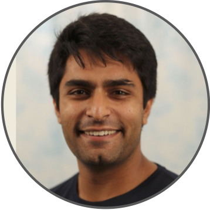

We are holding an online reading group focusing on <strong>modern adaptive experimental design and active learning in the real world</strong>. All interested participants are welcome to join!

The reading group will be held on <strong>Thursdays</strong> at <strong>10am PST/California</strong>, <strong>6pm GMT/UK</strong>, <strong>7pm CET/Zurich</strong> time. To add this to your calendar, <a href="https://calendar.google.com/calendar/u/0?cid=Mzg1OTc3M2I0MmJjNDIyNGQxZjE2MDA0ZWQ3OGUzNzlhOGViNzdlM2JiMmQ1NmFlYmZkZTU5M2RkOTVhYTEwN0Bncm91cC5jYWxlbmRhci5nb29nbGUuY29t">click here</a>. To receive information via email, <a href="https://forms.gle/Ex1ut4YfL8E3qt7W6">subscribe to our mailing list</a>.

To join, please use the following <strong>Zoom link:</strong> <a href="https://ethz.zoom.us/j/67585775251">https://ethz.zoom.us/j/67585775251</a> 

### Speaker Schedule

1. &nbsp;**January 12, 2023** &emsp;&nbsp;&nbsp;&nbsp; [Kelly W. Zhang](https://kellywzhang.github.io/)
    &emsp;&emsp;&emsp;&emsp;
2. &nbsp;**January 19, 2023** &emsp;&nbsp;&nbsp;&nbsp; [Kevin Jamieson](https://homes.cs.washington.edu/~jamieson/)
    &emsp;&emsp;&emsp;&nbsp;&nbsp;
3. &nbsp;**January 26, 2023** &emsp;&nbsp;&nbsp;&nbsp; [Raul Astudillo](https://raulastudillo.netlify.app/)
    &emsp;&emsp;&emsp;&emsp;&nbsp;&nbsp;
4. &nbsp;**February 2, 2023** &emsp;&nbsp;&nbsp;&nbsp;&nbsp; [Emmanuel Bengio](https://folinoid.com/)
    &emsp;&emsp;&nbsp;&nbsp;
5. &nbsp;**February 23, 2023** &emsp;&nbsp; [Haitham Bou Ammar](http://bouammar.com/)
    &emsp;&nbsp;
6. &nbsp;**March 2, 2023** &emsp;&emsp;&nbsp;&nbsp;&nbsp;&nbsp; [Kevin Tran](https://ktran9891.github.io/)
    &emsp;&emsp;&emsp;&emsp;&emsp;&ensp;&nbsp;&nbsp;
7. &nbsp;**March 9, 2023** &emsp;&emsp;&nbsp;&nbsp;&nbsp;&nbsp; [Zi Wang](https://ziw.mit.edu/)
    &emsp;&emsp;&emsp;&emsp;&emsp;&emsp;&ensp;&nbsp;
8. &nbsp;**March 16, 2023** &emsp;&emsp;&nbsp;&nbsp; [Viraj Mehta](https://virajm.com/)
    &emsp;&emsp;&emsp;&emsp;&emsp;&nbsp;&nbsp;
9. &nbsp;**March 23, 2023** &emsp;&emsp;&nbsp;&nbsp; [Johannes Kirschner](https://johannes-kirschner.de/)
    &emsp;&ensp;&nbsp;

### Next Talk

 &emsp;
[Emmanuel Bengio](https://folinoid.com/), &nbsp; **February 2, 2023**

**Title:** Introduction to GFlowNet

**Abstract:** GFlowNet, short for Generative Flow Network, is a new generative modeling framework which we think is particularly suited for discrete, combinatorial objects. The idea behind GFN is to estimate (graph-theoretic) flows in a directed acyclic network. The network represents all possible ways of constructing an object, and so knowing the flow gives us a policy which we can follow to sequentially construct objects in an energy-based fashion (i.e., objects are drawn proportionally to some quantity, like a reward or unnormalized density). In this talk I’ll present the framework, the intuition behind it, some nice properties it has, some cool things we can do with it and some really cool avenues for future work such as drug discovery.

**Relevant Papers:**
- [Flow Network based Generative Models for Non-Iterative Diverse Candidate Generation](https://arxiv.org/abs/2106.04399)
- [Multi-Objective GFlowNets](https://arxiv.org/abs/2210.12765)
- [Colab Notebook](http://colab.research.google.com/drive/1fUMwgu2OhYpQagpzU5mhe9_Esib3Q2VR)

**Bio:** Emmanuel Bengio is an ML Scientist at Recursion, working on the intersection of GFlowNets and de-novo drug design. He did his PhD under Joelle Pineau and Doina Precup at McGill/Mila, focusing on understanding generalization in deep RL.

### Past Talks

 &emsp;
[Raul Astudillo](https://raulastudillo.netlify.app/), &nbsp; **January 26, 2023**

**Title:** Composite Bayesian Optimization for Efficient and Scalable Adaptive Experimentation

**Video:** [youtube](https://youtu.be/suyiOz4uPPo)

**Abstract:** Experimentation is ubiquitous in science and a key driver of human progress. Many experimentation tasks can be cast as optimization problems with expensive or time-consuming to evaluate objective functions. Bayesian optimization has emerged as a powerful tool for tackling such problems. However, many experimentation tasks arising in high-stakes applications such as materials design and drug discovery are out of the reach of standard approaches. In this talk, I will describe recent advances that aim to address this challenge. In particular, I will focus on how the composite structure of many experimentation tasks can be exploited to improve the efficiency and scalability of Bayesian optimization methods. Finally, I will provide directions for future research toward a general framework for efficient end-to-end adaptive experimental design in complex settings.

**Relevant Papers:**
- [Bayesian Optimization of Function Networks](https://arxiv.org/abs/2112.15311)
- [Thinking inside the box: A tutorial on grey-box Bayesian optimization](https://arxiv.org/abs/2201.00272)
- [Preference Exploration for Efficient Bayesian Optimization with Multiple Outcomes](https://arxiv.org/abs/2203.11382)

**Bio:** Raul is a Postdoctoral Scholar in the Department of Computing and Mathematical Sciences at Caltech, hosted by Professor Yisong Yue. He obtained his Ph.D. in Operations Research and Information Engineering from Cornell University, working under the supervision of Professor Peter Frazier. Before that, he completed the undergraduate program in Mathematics offered jointly by the University of Guanajuato and the Center for Research in Mathematics in Mexico. In 2021, he was a Visiting Researcher at Meta within the Adaptive Experimentation team led by Eytan Bakshy. Raul's research interests lie at the intersection between operations research and machine learning, with an emphasis on Bayesian methods for efficient sequential data collection. His work combines principled decision-theoretic foundations with sophisticated machine learning tools to develop frameworks for adaptive experimentation in robotics, materials design, cellular agriculture, and other scientific applications.

 &emsp;
[Kevin Jamieson](https://homes.cs.washington.edu/~jamieson/), &nbsp; **January 19, 2023**

**Title:** Lessons learned in deploying bandit algorithms

**Video:** [youtube](https://youtu.be/RM4oIVd85Nk)

**Abstract:** Bandit algorithms, and adaptive experimentation more generally, promise the same statistically significant guarantees as, say, non-adaptive A/B testing, but require far fewer trials which results in a savings in time and money. However, such promises hold only under assumptions that rarely hold in practice, and for algorithms that may require unrealistic data interaction patterns. This talk explores this tension through two case studies in deploying state of the art algorithms to a large online experimentation platform and a robotics application in an industrial setting. Problems will be discussed, sensible solutions will be proposed, and opinions will be offered.

**Relevant Papers:**
- [Instance-optimal PAC Algorithms for Contextual Bandits](https://arxiv.org/abs/2207.02357)
- [A Bandit Approach to Multiple Testing with False Discovery Control](https://arxiv.org/abs/1809.02235)

**Bio:** Kevin Jamieson is an Assistant Professor in the <a href="http://cs.washington.edu/">Paul G. Allen School of Computer Science & Engineering</a> at the University of Washington and is the Guestrin Endowed Professor in Artificial Intelligence and Machine Learning. He received his B.S. from the University of Washington, his M.S. from Columbia University, and his Ph.D. In 2015 from the University of Wisconsin - Madison under the advisement of <a href="http://nowak.ece.wisc.edu/">Robert Nowak</a>, all in electrical engineering. He returned to the University of Washington as faculty in 2017 after a postdoc in the <a href="https://amplab.cs.berkeley.edu/">AMP lab</a> at the University of California, Berkeley working with <a href="https://people.eecs.berkeley.edu/~brecht/">Benjamin Recht</a>. Jamieson's work has been recognized by an NSF CAREER award and Amazon Faculty Research award. Jamieson’s research explores how to leverage already-collected data to inform what future measurements to make next, in a closed loop.

 &emsp;
[Kelly W. Zhang](https://kellywzhang.github.io/), &nbsp; **January 12, 2023**

**Title:** Inference after Adaptive Sampling for Longitudinal Data

**Video:** [youtube](https://youtu.be/o3Hw6BCySXY)

**Abstract:** Online algorithms that learn to optimize treatments over time are increasingly used in a variety of digital intervention problems. These algorithms repeatedly update parameter estimates as data accrues; these parameter estimates are used to inform treatment decisions. These algorithms are called “adaptive sampling” algorithms and the resulting data is considered “adaptively collected.” In this work, we focus on data collected by a large class of adaptive sampling algorithms that are designed to optimize treatment decisions online using accruing data from multiple users. Combining or “pooling” data across users allows adaptive sampling algorithms to potentially learn faster. However, by pooling, these algorithms induce dependence between the collected user data trajectories; this makes statistical inference on this data-type especially challenging. We provide methods to perform a variety of statistical analyses on such adaptively collected data, including Z-estimation, off-policy analyses, and inferring excursion effects. This work is motivated by our work in designing experiments in which online reinforcement learning algorithms pool data across users to learn to optimize treatment decisions, yet reliable statistical inference is essential for conducting a variety of statistical analyses after the experiment is over.

**Bio:** Kelly W. Zhang is a final-year Ph.D. candidate in computer science at Harvard University advised by Susan Murphy and Lucas Janson. Her research focuses on addressing challenges faced when applying reinforcement learning algorithms to real-world problems. She has developed methods for statistical inference for data collected by bandit and reinforcement learning algorithms, i.e., adaptively collected data. She also works on developing the reinforcement learning algorithm to be used in Oralytics, a mobile health app aimed to help users develop healthy oral hygiene habits, in collaboration with Oral-B and researchers at UCLA and UMichigan. She is supported by an NSF Graduate Research Fellowship.

<!--1. &nbsp;**January 12, 2023** &emsp;&nbsp;&nbsp;&nbsp; [Kelly W. Zhang](https://kellywzhang.github.io/), Harvard University-->
<!--    &emsp;&emsp;&emsp;&emsp;-->
<!--2. &nbsp;**January 19, 2023** &emsp;&nbsp;&nbsp;&nbsp; [Kevin Jamieson](https://homes.cs.washington.edu/~jamieson/), University of Washington-->
<!--    &emsp;&emsp;&emsp;&nbsp;&nbsp;-->
<!--3. &nbsp;**January 26, 2023** &emsp;&nbsp;&nbsp;&nbsp; [Raul Astudillo](https://raulastudillo.netlify.app/), Caltech-->
<!--    &emsp;&emsp;&emsp;&emsp;&nbsp;&nbsp;-->
<!--4. &nbsp;**February 2, 2023** &emsp;&nbsp;&nbsp;&nbsp;&nbsp; [Emmanuel Bengio](https://folinoid.com/), Recursion-->
<!--    &emsp;&emsp;&nbsp;&nbsp;-->
<!--5. &nbsp;**February 9, 2023** &emsp;&nbsp;&nbsp;&nbsp;&nbsp; [Zi Wang](https://ziw.mit.edu/), Google Brain-->
<!--    &emsp;&emsp;&emsp;&emsp;&emsp;&emsp;&ensp;&nbsp;-->
<!--6. &nbsp;**February 16, 2023** &emsp;&nbsp; [Johannes Kirschner](https://johannes-kirschner.de/), University of Alberta-->
<!--    &emsp;&ensp;&nbsp;-->
<!--7. &nbsp;**February 23, 2023** &emsp;&nbsp; [Haitham Bou Ammar](http://bouammar.com/), UCL and Huawei London-->
<!--    &emsp;&nbsp;-->
<!--8. &nbsp;**March 2, 2023** &emsp;&emsp;&nbsp;&nbsp;&nbsp;&nbsp; [Kevin Tran](https://ktran9891.github.io/), Toyota Research Institute-->
<!--    &emsp;&emsp;&emsp;&emsp;&emsp;&ensp;&nbsp;&nbsp;-->

<!-- -->
<!-- &nbsp;-->
<!-- &nbsp;-->
<!-- &nbsp;-->
<!-- &nbsp;-->
<!-- &nbsp;-->
<!-- &nbsp;-->
<!-- &nbsp;-->
<!-- &nbsp;-->
